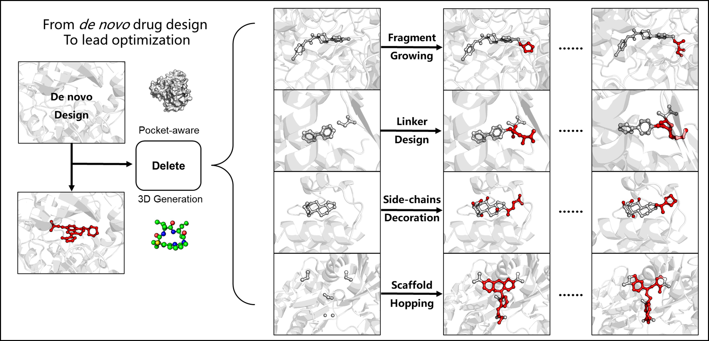
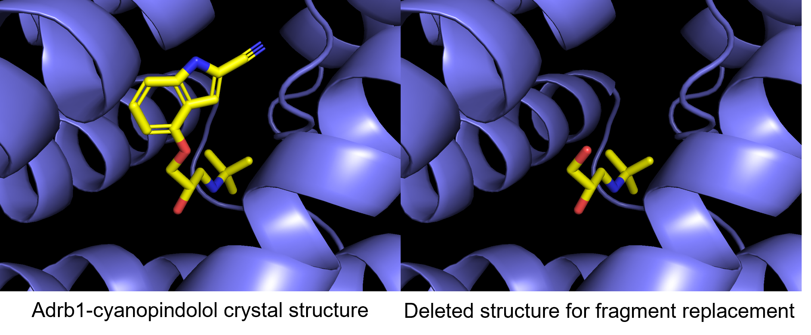
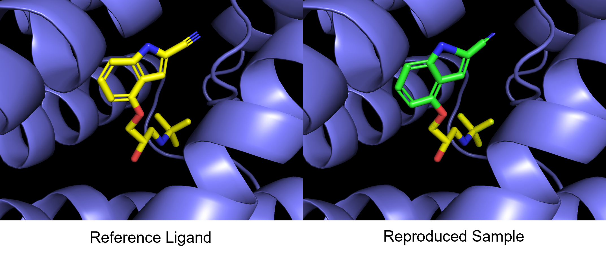
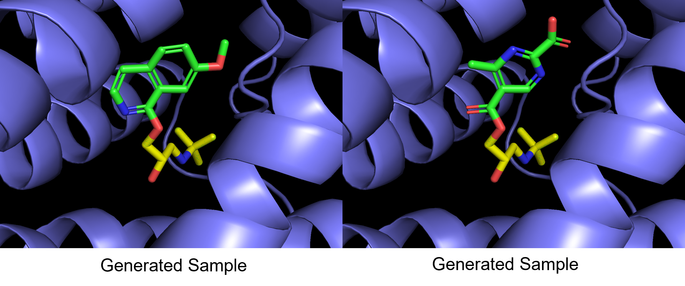
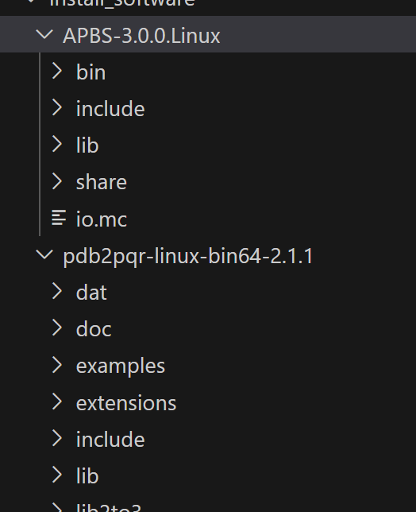
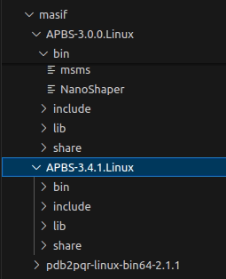

# :ghost:Delete: Deep Lead Optimization Enveloped in Protein Pockets through Deleting Strategy combined with a structure-aware network 
——When you face some problems in drug discovery, just delete! 

<div align=center>

</div>


## Environment

### CUDA11.3: Install via conda .yml file

```python
conda install mamba
mamba env create -f delete_environment.yml -n delete
conda activate delete 
```

If you're reluctant to use mamba: 

```python
conda env create -f delete_environment.yml -n delete
```

### CUDA11.3: Install via conda-pack file 

We also provide conda-packed file [here](https://doi.org/10.5281/zenodo.7980554). Download it and then unzip it in your conda/envs/dir. For me, the directory is ~/.conda/envs. Special thanks to the creators and organizers of zenodo, which provides a free platform to store large files for academic use. 

```shell
mkdir ~/.conda/envs/delete
tar -xzvf delete.tar.gz -C ~/.conda/envs/delete
conda activate delete
```

### CUDA 12.1: Install manually

Since Nvidia 40 series cards no longer support CUDA 11.3, I also created the SurfGen environment for an RTX-4080-powered linux system. 

```shell
mamba create -n delete pytorch==2.2.2 torchvision==0.17.2 torchaudio==2.2.2 pytorch-cuda=12.1 plyfile pyg rdkit biopython easydict jupyter ipykernel lmdb -c pytorch -c nvidia -c pyg -c conda-forge
pip install lmdb
pip install pyg_lib torch_scatter torch_sparse torch_cluster torch_spline_conv -f https://data.pyg.org/whl/torch-2.2.0+cu121.html
```

Note: PyG subgraph function has been put to another place, therefore, replace the following command at ./utils/transform.py

```python
# from torch_geometric.utils.subgraph import subgraph
from torch_geometric.data.data import subgraph
```


## Generate novel structures

I have provided an example to suggest new structures using adbr1 example, use this command to generate 3D molecules given the protein and lead fragment! The pretrained checkpoint could be downloaded [here](https://doi.org/10.5281/zenodo.7985201). (More pre-trained ckpt can be found in our updated Protocol Section)

```python
python -u delete.py --surf_path ./example/adrb1/adrb_pocket_8.0.ply --frag_path ./example/adrb1/2VT4_frag.sdf --check_point ./checkpoint/ckpt/delete.pt --outdir ./outputs --suboutdir adrb1
# main parameters: 
# --surf_path: the provided surface file
# --frag_path: the lead waiting for optimization
```

Here, I provide a famous drug-design example, the inhibitor for adrb1, which can be used in the treatment of hypertension. The crystal structure of bounded cyanopindolol was selected as the reference ligand. Then we delete its heteroaromatic moiety, retaining solely the ethanolamine backbone as the foundation for Delete generation.

<div align=center>

</div>

Using the above command for generation, about 100 structures are generated, and one of the generated samples successfully reproduces the cyanopindolol structure, both 2D chemical formula and 3D binding conformation. 

<div align=center>

</div>

 Besides, it also suggests several ligands that are potentially bound to the provided adrb1 structure. This example shows how powerful Delete can be, it fully considers the geometric and chemical environment of pockets. When you face some problems in drug discovery, just Delete!

<div align=center>

</div>


## Delete Protocol (New Feature)

Here is the [Protocol](https://github.com/HaotianZhangAI4Science/delete-protocol) we utilized to generate a diverse set of molecules. It includes scripts and additional checkpoints. Essentially, the protocol employs the concept of model ensembling to mitigate potential biases during training and to enhance the diversity of the generative models.

 


## Data

There are two datasets used for training, one is CrossDock2020, another is BindingMoad. 

If you want to process from scratch, please refer to the ./data/README.MD

Here, we provided the processed file in lmdb format. 

[CrossDock](https://doi.org/10.5281/zenodo.7980002) includes lmdb, lmdb-lock, name2id, split_by_name. 

[BindingMoad](https://doi.org/10.5281/zenodo.7980026) includes lmdb, lmdb-lock, name2id, split_by_name. 


## Train

```shell
python delete_train.py --config ./configs/train_{}.yml 
```


## Optional Make surface data on your own

### create the base Python environment

#### Approach 1

Despite the fact that we've already prepared the necessary data for training and evaluation, you might want to utilize SurfGen for your specific use case. To facilitate this, we've outlined guidelines to assist in creating your own 'surf_maker' environment.

```shell
conda create -n surface pymesh2 jupyter scipy joblib biopython rdkit plyfile -c conda-forge
```

#### Approach 2 

```shell
conda env create -f surf_maker_environment.yml
```

#### Install APBS Toolkits

When the base python environment was created, then install [APBS-3.0.0](https://github.com/Electrostatics/apbs/releases), [pdb2pqr-2.1.1](https://github.com/Electrostatics/apbs-pdb2pqr/releases) on your computer. Then set the msms_bin, apbs_bin, pdb2pqr_bin, and multivalue_bin path directly in your  `./bashrc`  or just set them in the scripts when creating the surface file from the pdb file.  (Like `./utils/masif/generate_prot_ply.py` )

​    

#### Try Generate Surface Now !

Having successfully set up all the necessary environments, you can now proceed to generate surface data. Please follow the instructions in `./data/surf_maker` for this process. Alternatively, to test the successful configuration of your environment, you can execute the `./data/surf_maker/surf_maker_test.py` script.

```shell
from generate_prot_ply import compute_inp_surface
# or from utils.generate_prot_ply import compute_inp_surface
prot_path = './PLD-1/8k5n_protein.pdb'
lig_path = './PLD-1/8k5n_ligand.sdf'
compute_inp_surface(prot_path, lig_path)
# It will take about 10s to compute a ply file in a single run. 
```

If you face the error: "**error while loading shared libraries: libTABIPBlib.so: cannot open shared object file: No such file or directory**". please add the following line to your ~/.bashrc file or directly add it to the os.environ. Then set the msms_bin, apbs_bin, pdb2pqr_bin, multivalue_bin to the correct path in your system 

```python
import os
# change the path for your own path
os.environ["LD_LIBRARY_PATH"] = '/home/haotian/Molecule_Generation/SurfBP/dataset/install_software/APBS-3.0.0.Linux/lib'
msms_bin="/home/haotian/Molecule_Generation/SurfBP/dataset/install_software/APBS-3.0.0.Linux/bin/msms"
apbs_bin = '/home/haotian/Molecule_Generation/SurfBP/dataset/install_software/APBS-3.0.0.Linux/bin/apbs'
pdb2pqr_bin="/home/haotian/Molecule_Generation/SurfBP/dataset/install_software/pdb2pqr-linux-bin64-2.1.1/pdb2pqr"
multivalue_bin="/home/haotian/Molecule_Generation/SurfBP/dataset/install_software/APBS-3.0.0.Linux/share/apbs/tools/bin/multivalue"
```


## Video Material 

I also prepared a basic usage in [Chinese](https://meeting.tencent.com/v2/cloud-record/share?id=9ac8be7f-495d-4489-ab2a-53d413f17c0c&from=3&record_type=2). 

The English version tutorial is coming soon. If you feel necessary, please reach out. 

## Cite

Zhang, Haotian, et al. "Delete: Deep Lead Optimization Enveloped in Protein Pocket through Unified Deleting Strategies and a Structure-aware Network." *arXiv preprint arXiv:2308.02172* (2023).


## Common Issue

For surface generation, a common error is:

```shen
No such file or directory: '/tmp/tmpc5aa wvj/temp1_out.csv'
```

This error primarily originates from APBS tools. Breaking down the code reveals the exact problem:

```shell
error while loading shared libraries: libTABIPBlib.so: cannot open shared object file: No such file or directory
```

This occurs because the APBS library is not included in the `LD_LIBRARY_PATH`

### How to fix

For **Ubuntu 18 system**, once you download [APBS-3.0.0](https://github.com/Electrostatics/apbs/releases) (~300MB) and [pdb2pqr-2.1.1](https://github.com/Electrostatics/apbs-pdb2pqr/releases) on your computer, like:

<div align=center>

</div>


Then, add the `LD_LIBRARY_PATH` to your `~/.bashrc`, for example:

```shell
# Install Vim if necessary:
sudo apt install vim

# Edit ~/.bashrc
vim ~/.bashrc

# Append the following command at the end of the ~/.bashrc:
...
export LD_LIBRARY_PATH="/home/haotian/software/miniconda3/envs/deepdock/lib:$LD_LIBRARY_PATH"
...
# Save and exit Vim, then activate the setting:

source ~/.bashrc # active the setting
```

However, sometimes another error might occur:

```shell
libreadline.so.7: cannot open shared object file: No such file or directory
```

When I encountered this problem, I was using  **Ubuntu 22**. I found that `libreadline.so.7` is only available for **Ubuntu 18**, and there is no easy way to install `libreadline.so.7` on Ubuntu 22 system. Eventually, I found a solution by downloading both `APBS-3.0.0` and `APBS-3.4.1`. I stored these two software in [Zenodo](https://doi.org/10.5281/zenodo.11179235). 

<div align=center>

</div>


Assign the paths at `./utils/masif/generate_prot_ply.py` as follows:

```python
msms_bin="{install_path}/APBS-3.0.0.Linux/bin/msms"
apbs_bin = '{install_path}/APBS-3.4.1.Linux/bin/apbs'
pdb2pqr_bin="{install_path}/pdb2pqr-linux-bin64-2.1.1/pdb2pqr"
multivalue_bin="{install_path}/APBS-3.0.0.Linux/share/apbs/tools/bin/multivalue"
```

